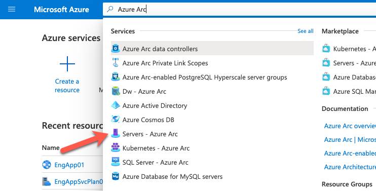
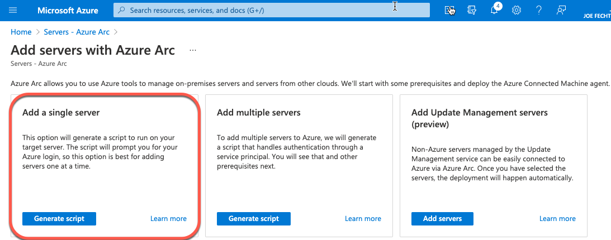
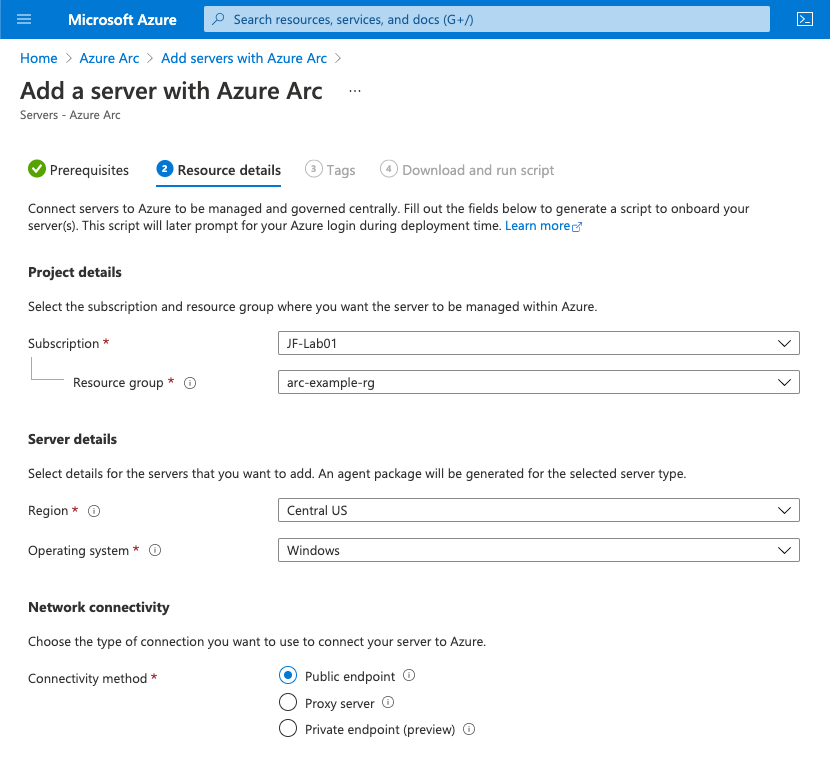
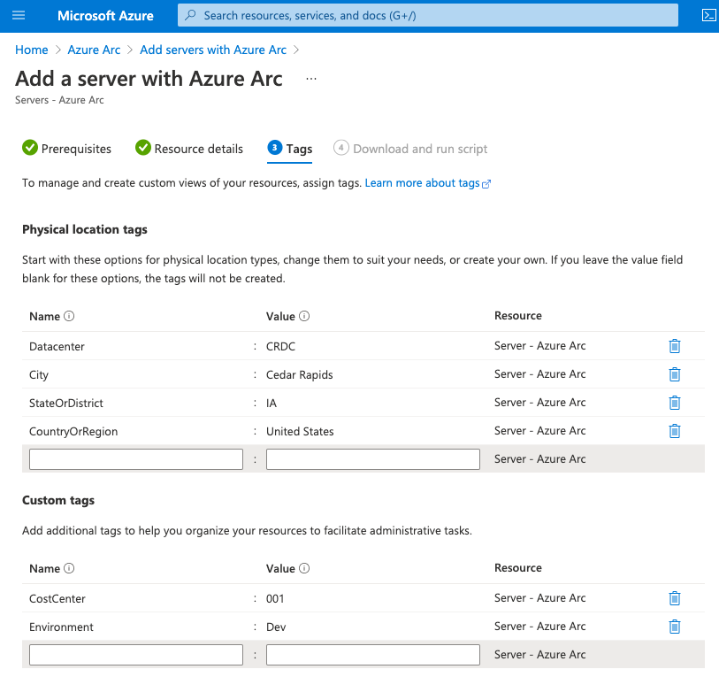
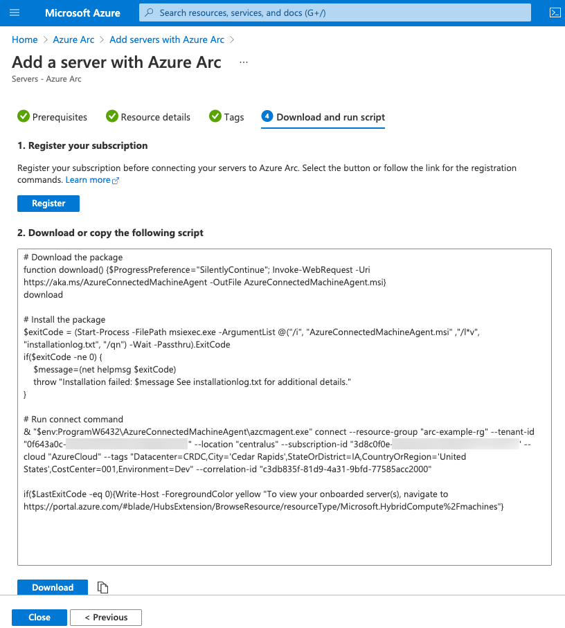
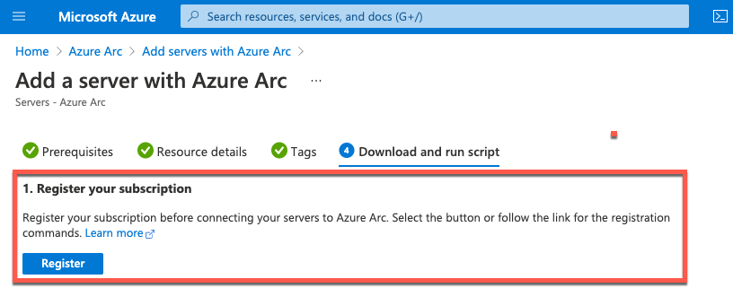
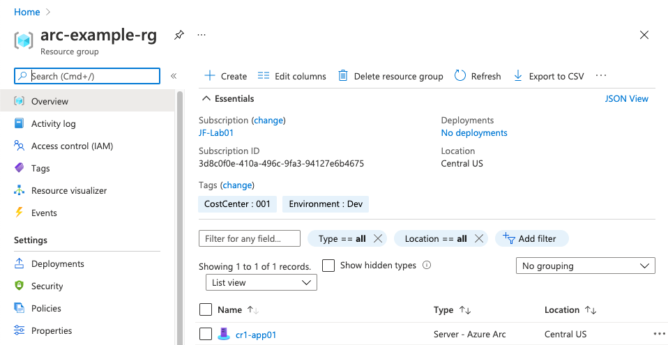

# Introduction to Azure Arc

### What is Azure Arc

Our cloud providers today have given us a variety of tools to help manage the resources you have running within then.  The major vendors each have their own solutions to help us monitor, maintain security, and managing deployments in their ecosystem.  However, most of us have resources that are running on more than one cloud platform and on-premises.  Wouldn't it be great to have a way to manage those without having to learn another tool?

This is where Azure Arc can help fill that gap.  By allowing you to manage a resource regardless of which platform is hosting it.  Today we are going to focus on Azure Arc enabled servers.  


### Prerequisites

1. An Azure account (A free trial subscription will work)
2. A VM that is hosted outside of Azure (On-premises or in another cloud vendor) that has internet access.
3. The VM must be a [supported operating system](https://docs.microsoft.com/en-us/azure/azure-arc/servers/agent-overview#supported-operating-systems).
4. Administrator or root level access to that VM. 


### How it works

Azure Arc works by having an agent that runs on the resource.  When this agent is deployed, you specify some information about your Azure environment.  It will use this information to create a resource in your Azure subscriptions.   Once the resource shows up in Azure you now have a few different ways that you can manage it.  This can include installing extensions to gather logs, monitor its utilization, or to deploy a software on it.  Much the same as you can do to the resource as if it was running in Azure. 


### How to install the Azure Arc agent on a single server 

Let's assume we have a VM running in VMware on-premises that we'd like to manage in Azure Arc.   The first thing we need to do is download and install the agent to that machine.  To do that let's go to our Azure Portal and search for Azure Arc and select "Servers - Azure Arc" from the list.  (We can see other Arc services listed but that will be for future blog posts). Then



In the "Servers - Azure Arc" screen, we will select "Add" in the top left.   This will pull up a screen giving us a few different options on what type of installer we would like to use.   Since we are only doing a single VM this time we will select "Add a single server", but will keep this in mind for future deployments. 



It will give us a list of prerequisites that were mentioned above.   On the "Resource details" page it will give a chance to determine where the resource is represented in Azure as well as the operating system type.  We will representing this server in the resource group "arc-example-rg" in the "Central region.   



We can now define tags on it just like we would about any other resource in Azure.  It even pre-populates some tags keys that can be helpful to identify a resource that isn't hosted within Azure like "City", "Datacenter".   



We now have a chance to view the script that we need to run our VM.   You can see the script will download and install the AzureConnectedMachineAgent.msi file.  It will then configure the agent using the information we specified in the portal.



An important item to note at the top of the screen is that the subscription we selected has not been registered yet.  Part of Azure Arc requires that the providers for Hybrid Compute and Guest Configuration need to be enabled.  These providers are what allows resources that "live" outside of Azure to be managed by Azure Resource Manager.  Thankfully, we can simply click the "Register" button on the top and Azure will take of registering those for us.  

If you want to see how register the providers via Azure CLI you can find the details [here](https://docs.microsoft.com/en-us/azure/azure-arc/servers/learn/quick-enable-hybrid-vm#register-azure-resource-providers).




Now that we have prepared the script that will enable our server to be managed by Azure Arc, lets log onto our VM and run the installer.  I have saved the file that Azure provider as 'arc.ps1' to the Downloads folder on the VM.  I then opened an administrative PowerShell window and executed the powershell file.  As we can see below, it will prompt us to login to authenticate with Azure as part of the installer.  This is needed so the Azure Arc agent can talk to your Azure environment.

Now we can see the VM listed in the Azure Portal.   



Success!!  This works really well for a single server, but as we scale out you can see this can quickly become a pain having to authenticate each time.  Lets see what how we can make this more scalable. 

### Installing Azure Arc on multiple servers

When it comes to installing the Arc Agent at scale, the process is similar to what we did on a single server.   The biggest difference is that we specify how the server will authenticate to Azure during the install without us being prompted. 

To do this we create a service principal that will allow the installation script to authenticate.  

Lets run the following script to create our service principal.    This will create the service principal, assign the appropriate RBAC role needed to join an Azure Arc server, and will provide us with the password.  

```powershell
$spName = "AzureArcForServers"

$Guid = New-Guid
$startDate = Get-Date

$PasswordCredential 				= New-Object -TypeName Microsoft.Azure.Commands.ActiveDirectory.PSADPasswordCredential
$PasswordCredential.StartDate 		= $startDate
$PasswordCredential.EndDate 		= $startDate.AddYears(1)
$PasswordCredential.KeyId 			= $Guid
$PasswordCredential.Password		= ([System.Convert]::ToBase64String([System.Text.Encoding]::UTF8.GetBytes(($Guid))))+"="

$app = New-AzADApplication -DisplayName $spName -PasswordCredentials $PasswordCredential
$scope = "/subscriptions/" + (Get-AzContext).Subscription.Id

$sp = New-AzAdServicePrincipal -ApplicationId $app.ApplicationId

New-AzRoleAssignment -ObjectId $sp.Id -roleDefinitionName "Azure Connected Machine Onboarding" -scope $scope
Remove-AzRoleAssignment -ObjectId $sp.Id -RoleDefinitionName "Contributor" -Scope $scope

$spOutput = "Application Details for the $spName application:
=========================================================
Application Name: 	$spName
Application Id:   	$($sp.ApplicationId)
Secret Key:       	$($PasswordCredential.Password)
"
Write-Host
Write-Host $spOutput
```

As we run this it will output the information needed for the Arc onboarding script to authenticate.  This includes both the application ID of the service principal and it's secret (aka - password). 

This is an example of the output below.


We can now take this information and adjust the sample script that we used when we deployed a single server.  The primary difference is we are now defining the service principal ID and secret as variables.  We are then passing those variables to  azcmagent.exe so it can authenticate to Azure.   Everything else is essentially the same. 


```powershell
# Add the service principal application ID and secret here
$servicePrincipalClientId="94c95803-7141-4f2d-b224-33f391f71c87"
$servicePrincipalSecret="M2MzNDk3YTYtMjY5ZS00NWMwLTk2YWItMTYyMTJiMjE4MjVm="
$resourceGroupName = "arc-example-rg"
$location = "centralus"

# Download the package
function download() {$ProgressPreference="SilentlyContinue"; Invoke-WebRequest -Uri https://aka.ms/AzureConnectedMachineAgent -OutFile AzureConnectedMachineAgent.msi}
download

# Install the package
$exitCode = (Start-Process -FilePath msiexec.exe -ArgumentList @("/i", "AzureConnectedMachineAgent.msi" ,"/l*v", "installationlog.txt", "/qn") -Wait -Passthru).ExitCode
if($exitCode -ne 0) {
    $message=(net helpmsg $exitCode)
    throw "Installation failed: $message See installationlog.txt for additional details."
}

# Run connect command
& "$env:ProgramW6432\AzureConnectedMachineAgent\azcmagent.exe" connect --service-principal-id "$servicePrincipalClientId" --service-principal-secret "$servicePrincipalSecret" --resource-group "$resourceGroupName" --tenant-id "0f643a0c-xxxx-xxxx-xxxx-xxxxxxxxxxxxxx" --location "$location" --subscription-id "3d8c0f0e-xxxx-xxxx-xxxx-xxxxxxxxxxxxxx" --cloud "AzureCloud" --correlation-id "8c1e22da-8eae-47a9-ad8e-730022ae2011"

if($LastExitCode -eq 0){Write-Host -ForegroundColor yellow "To view your onboarded server(s), navigate to https://portal.azure.com/#blade/HubsExtension/BrowseResource/resourceType/Microsoft.HybridCompute%2Fmachines"}
```

#### Reality check
You would never create a script like the above and use it as is.  You NEVER save scripts with credentials in them.   This is strictly showing you the difference between the single use and the multiple use script.  In production you would use your configuration management tool (like Ansible, Puppet, etc...) to deploy this and should have the credentials saved as secrets within the tool.  

##### Back to your regularly scheduled programming

We can now use this script to install the Azure Arc enabled agent on multiple servers without having to be prompted for credentials.  The process is the same as with a single server, we need to run the PowerShell script and it will download, install and configure the agent.  

### Conclusion

Azure Arc is a great way for us to manage multiple resource types from Azure in a centralized and consolidated manner.  This in itself is nice but not super exciting.  As you start incorporating other Azure tools, like Sentinel and Azure Policy, you start to fully see the power that Azure Arc provides.  You could be so daring as to use the "Single pane of glass" phrase that gets thrown around excessively.   In this instance though, I feel it is fully justifiable.  